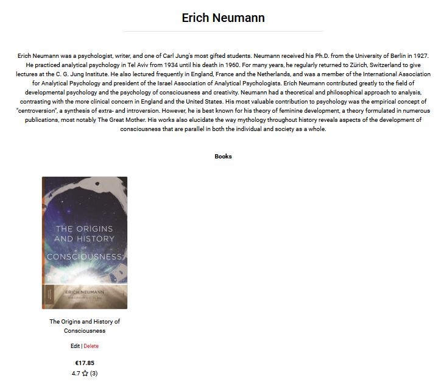
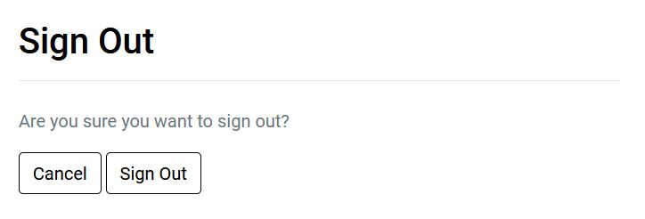

# PaperBack - "We're bring paper back."

PaperBack is an online book store that specialises in physical books. The target audience for the website would be people who like to read and who prefer reading physical books.

[Click here to view website.](https://paperback-pp5-4d817902330a.herokuapp.com/)

# Components / Features / Pages

## 1 - Home Page

USER STORY: Home Page

  

**Contains**:

- Intro section - welcomes user to the site, tells them what the site does, and links to our selection of books.

- Latest additions - displays the 3 most recent additions to the shop.

## 2 - Nav Bar

USER STORY: Nav Bar/Bootstrap Install

Repsonsively houses easy-to-reach, useful links for the user.

- Desktop  
  

- Mobile (closed)  
  

- Mobile (open)  
  

- Mobile (open & account dropdown)  
  

**Contains**:

- Search bar - allows user to easily search letters/words found in the book titles, book descriptions, and author names.

- Account dropdown - gives user access to sign in, sign out, registration and profile pages.

- Shopping bag link - keeps track of user's shopping bag total for the current session, and acts as link to get to the shopping bag page.

- Banner - allows users to quickly navigate to home, books, and contact form pages.

## 3 - Footer

USER STORY: Footer / Mailchimp Newsletter

  

**Contains**:

- Social media links - Facebook links to a facebook page created for the ecommerce site. Youtube just links to youtube homepage for now. Both links contain the noopener and nofollow rel attributes.

- Mailchimp newsletter sign up form - user can enter email to be added a newsletter mailing list.

## 4 - Books Page

USER STORY: View Books

  

**Contains**:

- Book count & sorting - tells user the total number of books on display, and allows user to sort the books in terms of name, price and average review rating (both ascending and descending)

- Book info - basic book info is given, including the cover image, title, price and review info. Both the cover image and title act as links to take you to the book detail page.

## 5 - Book Detail Page

USER STORY: View Books
USER STORY: View Book Reviews

- Detail 1  
  

- Detail 2  
  

- Reviews  
  

**Contains**:

- Book detail - includes cover image, title, author, review score/number of reviews in parenthesis and price. The author is a link the author page.

- Add to bag - user can select the option (if there is one), select the quantity they want, and add their deserved option combo quantity to shopping bag.

- Reviews - user can see how other users have reviewed the book in more detail. They can also add a review of their own if they are signed in.

## 6 - Add Review Page

USER STORY: Create Book Reviews

  

**Contains**:

- Add review form - only required field is the rating field, if user is short on words/time. Once submitted, user is taken back to book detail page, where they can see their review added to the review section.

## 7 - Shopping Bag Page

USER STORY: Shopping Bag

- Desktop  
  

- Mobile  
  

**Contains**:

- Bag Summary - user can double check book options, quantity, and price before goign to checkout.

- Update & remove item - allows user to change the quanity of a book or remove a book from the bag entirely.

- Back to top arrow - mobile display has a handy arrow to allow user to quickly jump back to top of the page.

## 8 - Checkout Page

USER STORY: Checkout Page / Stripe 

 

**Contains**:

- checkout form - user can enter in their shipping and contact details.

- stripe card element - user can process their payment through a trustworthy company.

- save delivery info checkbox - allows signed in user to save their delivery info to their profile, to speed up future purchases.

- another order and price summary - for user clarity and peace of mind.

## 9 - Checkout Success / Order Summary Page

USER STORY: Checkout Page / Stripe 

  

**Contains**:

- Order summary - user can see all relevant info regarding their order. This page can also be revisted through the user's profile order history section (if the user has registered for an account). It also lets user know a confirmation should be in their email inbox.

## 10 - Add Book Page (superuser)

USER STORY: Add Book

  

**Contains**:

- Add book form - contains inputs for name, description, if the book has options, price, image url, and image. Only name, description and price fields are mandatory. Once submitted, user is taken to book detail page where they can view the book they just added to the store.

## 11 - Edit / Delete Book (superuser)

USER STORY: Edit Books
USER STORY: Delete Books

  

**Contains**:

- Edit book button / form - button visible under book on books page, book detail page and author page. User is taken to an edit book form (identical to add book form styling). User can change book details. Once submitted, user is taken to book detail page where they can view the updated details.

- Delete book button - visible in same places as edit button. Once pressed, book is deleted and user is taken to the books page, where deleted book will no longer be visible.

## 12 - Contact Page

USER STORY: Contact Form

  

**Contains**:

- Contact form - allows users to send a message to the site owner, if they have any feedback, questions, requests etc.

## 13 - Author Page 

USER STORY: View Author

Reached through link on the book detail page (author's name is the link).

  

**Contains**:

- Bio - a brief description of the author's career/life.

- Books - a display of which books the author currently has in site's store.

## 14 - Profile Page 

USER STORY: Profile App

  

**Contains**:

- Saved delivery info - signed in users can enter delivery info here that will be saved to their profile. The info added here will automatically populate the checkout form any time they want to make a purchase. This info can also be added to the profile page/updated by the user clicking the save delivery info checkbox when making a purchase.

- Order history - a display of previous orders made by the user. The order number is a link to the order confirmation page associated with that order.

## 15 - Allauth / Account Management  Pages

USER STORY: Allauth/User Autorization Management

- Sign Up  
 

- Sign In  
 

- Sign Out  
 

**Contains**:

- allauth authentication, registration and account management - gives user high quality experience when working with their account, including email verification and password resets.

## 16 - Custom 404 Page 

USER STORY: Custom 404 Page

  

**Contains**:

- 404 - let's user know a 404 error has occured and provides them with a button link to get to the book store.

## 17 - Favicon

  

**Contains**:

- Favicon - makes it easier for user to find the tab to the site when they have multiple tabs open. It also adds a touch of professionalism to the site.

## end

- A Facebook business page

  - A business page has been created for marketing reasons, to further advertise the shop, post news and communicate with customers. favicon has been added to make it easier for users to find the Taste of Poland page if multiple tabs are open.
  - The page can be accessed [here](https://www.facebook.com/Bookworm-Paradise-106344228834492/?notif_id=1658868269617980&notif_t=page_invite_accept&ref=notif).

    

    

## User Experience Design

Bookworm Paradise is a responsive website of a non-existent online bookshop.

The aim of the website is:

- to give users an opportunity to purchase a book without an unnecessary hassle and going through complicated processes;
- to give users the possibility of browsing the available books by genres so that they can easily find what they are interested in;
- to give users the possibility of registering for an account in order to be able to save their delivery details and order history;
- to give users the possibility of registering for an account in order to be able to leave a book review (and edit or delete it if necessary);
- to give the site owners / authorised staff the possibility of viewing the orders and reviews users made so they can be modified or deleted if needed;
- to give users the possibility of accessing the website on any device;
- to give users the means necessary for them to be able to contact the shop owner.

### Business model

- Bookworm Paradise is based on a B2C (Business to Consumer) as it sells its books directly to the customer.
- As this is the case, it needs to maintain good relationship with its customers in order to build a customer base and thrive.
- A Facebook page has been created as it allows the shop owners to reach a wide range of customers and communicate with them regularly.

### Entity Relationship Diagram

### Wireframes

- Home

  

- All Books

  

- Book details

  

- Contact Us

  

## Technologies

- [HTML](https://developer.mozilla.org/en-US/docs/Web/HTML), [CSS](https://developer.mozilla.org/en-US/docs/Web/CSS), [JavaScript](https://developer.mozilla.org/en-US/docs/Web/JavaScript), [Python](https://www.python.org/)
- [Django](https://www.djangoproject.com/) was the framework used to build this website.
- [Bootstrap](https://getbootstrap.com/docs/4.0/getting-started/introduction/) was used to create and style the front end of the website.
- [Font Awesome](https://fontawesome.com/) icons have been used for the social media links in the Footer and links in the navbar.
- [Google Fonts](https://fonts.google.com/) have been used to import fonts.
- [Favicon](https://favicon.io/) was used to create the favicon for the website.
- [Techsini](http://techsini.com/multi-mockup/index.php) mockup generator was used to create the mockup image for the README.md file.
- [Google Chrome Developer Tools](https://developers.google.com/web/tools/chrome-devtools) were used to inspect elements of the website and test different styles.
- [GitHub](https://github.com/) has been used to store the code, images, and other contents of the website.
- [AWS](https://aws.amazon.com/) was used to store static and media files in deployed stage.
- [Stripe](https://stripe.com/gb) was used to set up the payment system for the shop.
- [Heroku](https://dashboard.heroku.com/apps) was used to deploy the game to the web.
- [Git](https://git-scm.com/) was used to track changes made to the project and to commit and push code to the repository.
- [Wave Web Accessibility Evaluation Tool](https://wave.webaim.org) was used to test the website's accessibility.
- [Lighthouse](https://developers.google.com/web/tools/lighthouse#devtools) was used to run an audit of the website.

## Testing

### Manual testing

| Test Case # | Description                                            | Steps                                                                                                                                                                                                                                                                                                                                                                        | Expected                                                                                                                                                                                                                                                                                                  | Actual                                                                                    | Pass/Fail |
| ----------- | ------------------------------------------------------ | ---------------------------------------------------------------------------------------------------------------------------------------------------------------------------------------------------------------------------------------------------------------------------------------------------------------------------------------------------------------------------- | --------------------------------------------------------------------------------------------------------------------------------------------------------------------------------------------------------------------------------------------------------------------------------------------------------- | ----------------------------------------------------------------------------------------- | --------- |
| 1           | Checkout form validation (including Stripe validation) | 1\. Incorrectly fill in checkout form and try to submit the form.  2\. Correctly fill in form and submit.                                                                                                                                                                                                                                                                 | 1. Form doesn't allow submission. 2\. Feedback is given to user to let them know what they need to change. 3\. When form is filled in correctly, the form successfully submits and user is taken to the chekout success page.                                                                       | As expected                                                                               | Pass      |
| 2           | Mailchimp form validation                              | 1\. Incorrectly fill in email field and try to submit the form.  2\. Correctly fill in email and submit.                                                                                                                                                                                                                                                                  | 1. Form doesn't allow submission. 2\. Feedback is given to user to let them know what they need to change. 3\. When form is filled in correctly, the form successfully submits and user is shown a success message.                                                                                 | As expected                                                                               | Pass      |
| 3           | Add to bag form validation (book detail page)          | 1\. Incorrectly fill in quantity field (less than 1, or greater than 99) and try to submit the form.  2\. Correctly fill in quantity and submit.                                                                                                                                                                                                                          | 1. Form doesn't allow submission. 2\. Feedback is given to user to let them know what they need to change. 3\. When form is filled in correctly, the form successfully submits and user is shown a success message.                                                                                 | As expected                                                                               | Pass      |
| 4           | Contact form validation                                | Incorrectly fill in contact form and try to submit the form.  2\. Correctly fill in form and submit.                                                                                                                                                                                                                                                                      | 1. Form doesn't allow submission. 2\. Feedback is given to user to let them know what they need to change. 3\. When form is filled in correctly, the form successfully submits and user is taken to home page and shown shown a success message.                                                    | As expected                                                                               | Pass      |
| 5           | Review form validation                                 | Incorrectly fill in review form by leaving the rating field blank and try to submit the form.  2\. Correctly fill in form and submit.                                                                                                                                                                                                                                     | 1. Form doesn't allow submission. 2\. Feedback is given to user to let them know what they need to change. 3\. When form is filled in correctly, the form successfully submits user is shown a success message, and review can be seen on the book detail page.                                     | As expected                                                                               | Pass      |
| 6           | Save delivery info checkbox                            | 1\. Sign into an account. 2\. Complete a checkout form, take note of the delviery information used, make sure the save delivery info checkbox is checked and submit the form.  3\. Repeat step 2 with different delivery info and unchecking the save delivery info checkbox.  4\. After order complete, go to the profile page and check the delivery information. | 1\. Delivery information on profile page matches the delviery info used with the first order.                                                                                                                                                                                                             | The delivery info was saving to the profile, whether the save info box was checked or not | Fail      |
| 7           | Profile form validation                                | 1\. Incorrectly fill in profile form form and try to submit the form.  2\. Correctly fill in form and submit.                                                                                                                                                                                                                                                             | 1. Form doesn't allow submission. 2\. Feedback is given to user to let them know what they need to change. 3\. When form is filled in correctly, the form successfully submits and user is shown a success message.                                                                                 | As expected                                                                               | Pass      |
| 8           | Add book form validation                               | 1\. Incorrectly fill in add book form and try to submit the form.  2\. Correctly fill in form and submit.                                                                                                                                                                                                                                                                 | 1. Form doesn't allow submission. 2\. Feedback is given to user to let them know what they need to change. 3\. When form is filled in correctly, the form successfully submits, user is taken to the book detail page, with info matching what what submitted, and user is shown a success message. | As expected                                                                               | Pass      |
| 9           | Edit book form validation                              | 1\. Incorrectly fill in edit book form form and try to submit the form.  2\. Correctly fill in form and submit.                                                                                                                                                                                                                                                           | 1. Form doesn't allow submission. 2\. Feedback is given to user to let them know what they need to change. 3\. When form is filled in correctly, the form successfully submits, user is taken to book detail page, which shows the updated book info, and user is shown a success message.          | As expected                                                                               | Pass      |
| 10          | Delete book button                                     | 1\. Sign in as super user and add 3 books  2\. Go to books page and press delete button under 1 of those books.  3\. Go to book detail page and press delete button under 1 of those books.  4\. Go to author page and press delete button under last of those books.                                                                                               | 1. With each delete press, user is taken to the books page and shown a success message. 2\. Deleted book can no longer be found on the books page.                                                                                                                                                     | As expected                                                                               | Pass      |
| 11          | Update bag item validation (bag page)                  | 1\. Add item to shopping bag and go to bag page.  2\. Incorrectly fill in quantity field (less than 1, or greater than 99), changing it from its original value, and try to submit the form.  3\. Correctly fill in quantity and submit.                                                                                                                               | 1. Form doesn't allow submission. 2\. Feedback is given to user to let them know what they need to change. 3\. When form is filled in correctly, the form successfully submits, user is shown a success message and the bag quantity matches their form input.                                      | As expected                                                                               | Pass      |
| 12          | Delete bag item button (bag page)                      | 1\. Add item to shopping bag and go to bag page.  2\. Press the delete button under the item.                                                                                                                                                                                                                                                                             | 1\. Bag page reloads, user is shown a success message, and bag is updated to reflect the removed item.                                                                                                                                                                                                    | As expected                                                                               | Pass      |

|

### Automated testing

All tests in tests.py files were run successfuly.

### Validator testing

- HTML - when the code was passed through the official [W3C validator](https://validator.w3.org/nu/?doc=https%3A%2F%2Fbookworm-paradise.herokuapp.com%2F)

  - When I passed my code through the W3C validator, two errors appeared. One of them stated that there was a stray 'label' tag somewhere in the code, and the other stated that there's a missing closing 'div' tag. I have located both of these in the main-nav.html file and corrected them.

  - After correcting the above, I run the validator again and this time no errors were found:

  

- CSS - no errors were found when code was passed through the official [(Jigsaw) validator](https://jigsaw.w3.org/css-validator/validator)

  

- JavaScript - when running the code through [JSHint linter](https://jshint.com/) I received the following error message referring to the two 'html' variables: "'template literal syntax' is only available in ES6 (use 'esversion: 6').". I copied /_jshint esversion: 6 _/ into the linter window to override this. After I did this, no more errors appeared.

  

- Python - when running the code through [PEP8 linter](http://pep8online.com/) I received a few 'line too long' errors referring to the automatically generated code in settings.py. As the code was auto-generated and there was not an easy fix to shorten the lines, I have left this error in. There were no errors in any files that have been coded and customised by me.

- Accessibility - when using the [Wave Web Accessibility Evaluation Tool](https://wave.webaim.org) to test the site's accessibility, I have encountered the following errors and/or warnings:
  - There were missing labels on some form inputs as the inputs had placeholders instead. I have added the labels and used the .visually-hidden class to hide them (I found info [here](https://www.a11yproject.com/posts/how-to-hide-content/#:~:text=visually%2Dhidden%20class%20is%20applied,focus%20indicator%20had%20gone%20to.))
  - Aria-labels were missing on some content - I have added all of them.
  - No further errors have been found after I applied the above fixes and passed the site through the validator again.
  

### Unfixed bugs

No other bugs found.

## Deployment

The below steps were followed to deploy this project to Heroku:

1. Go to [Heroku](https://dashboard.heroku.com/apps) and click 'New' to create a new app.
2. After choosing the app name and setting the region, press 'Create app'.
3. Go to 'Resources' to add a database and scroll down to 'Add-ons'. Search for 'Postgres' and choose 'Heroku Postgres' from available options.
4. Go to 'Settings' and navigate to 'Config Vars'. As the Postgres database has been connected, the DATABASE_URL is already there. Add the remaining config vars: AWS_ACCESS_KEY_ID, AWS_SECRET_ACCESS_KEY, EMAIL_HOST_PASS, EMAIL_HOST_USER, SECRET_KEY, STRIPE_PUBLIC_KEY, STRIPE_SECRET_KEY, STRIPE_WH_SECRET, USE_AWS (the values for these variables depend on your own personal set up and will not be added here for security reasons).
5. Leave 'Settings' and go to 'Deploy'. Scroll down and set 'Deployment Method' to GitHub. Once GitHub is chosen, find your repository and connect it to Heroku.
6. Scroll down to Manual Deploy, make sure the 'main' branch is selected and click 'Deploy Branch'.
7. The deployed app can be found [here](https://paperback-pp5-4d817902330a.herokuapp.com/).

## Credits

### Content & Media

The information about each book and author, and images related to the books, have been taken from:

- [Amazon](https://www.amazon.co.uk/)
- [Britannica](https://www.britannica.com//)
- [Wikipedia](https://www.wikipedia.org/)

### Acknowledgements

I'd like to thank my mentor Daisy McGirr for her guidance and great advice throughout this project.
